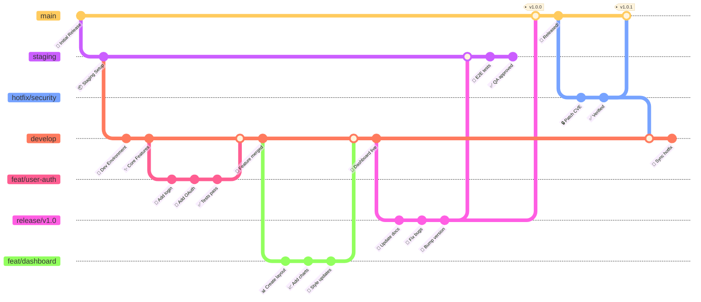
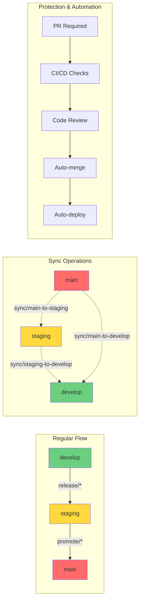
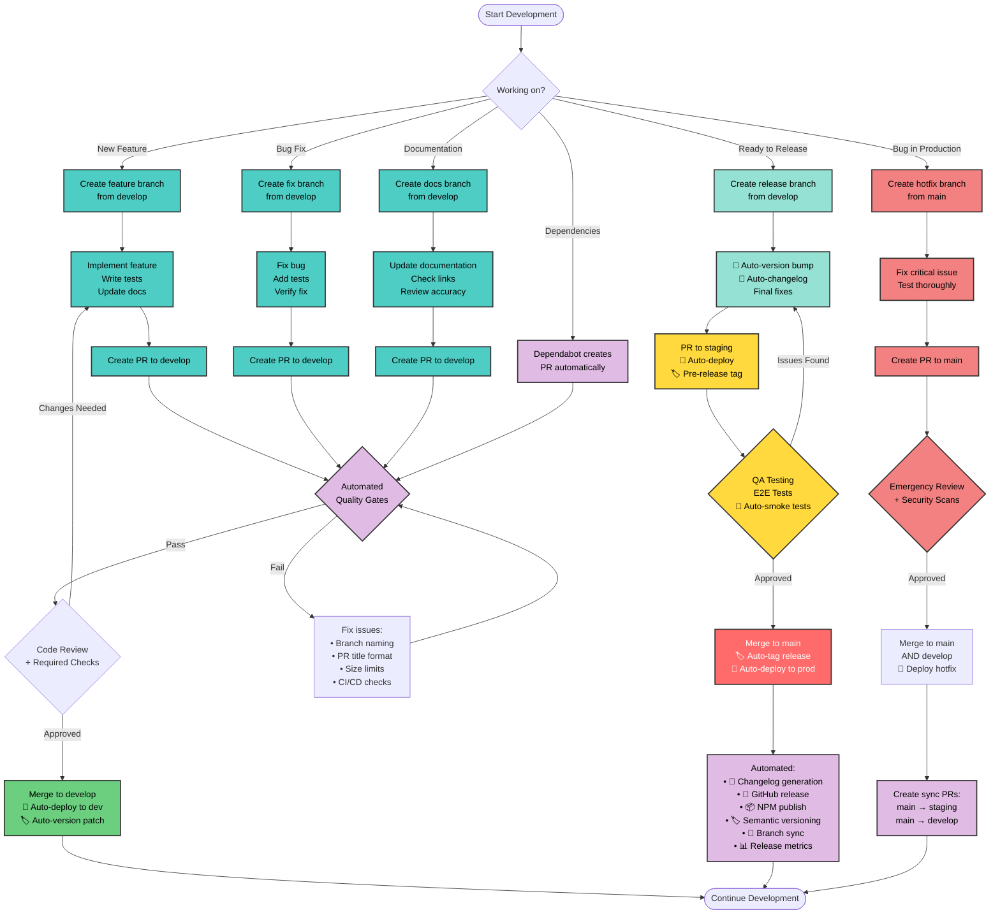
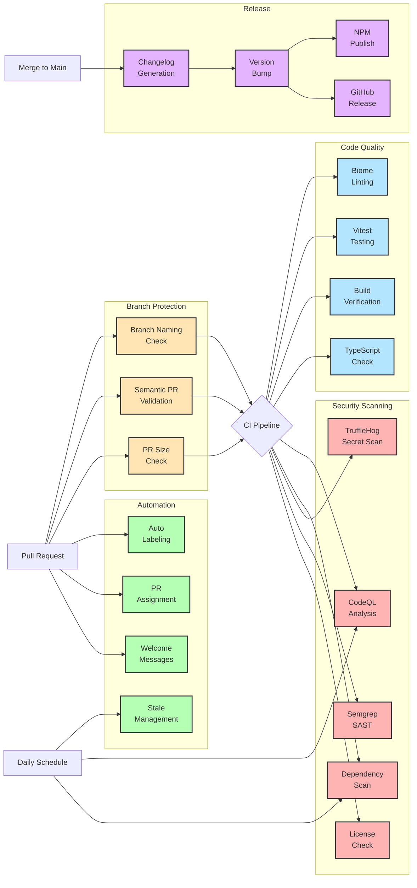

<div align="center">

# 🚀 Zopio Git Flow & CI/CD Pipeline

[](https://github.com/zopiolabs/zopio_init)
[](https://github.com/zopiolabs/zopio_init)
[](https://github.com/zopiolabs/zopio_init)

**The complete guide to Zopio's branching strategy, automated workflows, and development practices**

</div>

---

## -quick-navigation

## 🗺️ Quick Navigation

<table>
<tr>
<td>

### 🌳 Git Flow
- [Branch Overview](#-git-flow-overview)
- [Workflow Diagram](#-workflow-diagram)
- [Branch Types](#-branch-descriptions)
- [Protection Rules](#️-branch-protection-rules)

</td>
<td>

### 🤖 CI/CD
- [Pipeline Overview](#-cicd-pipeline-overview)
- [Workflow Matrix](#-workflow-triggers-matrix)
- [Automation](#-automated-dependency-management)
- [Security Scans](#-security-framework)

</td>
<td>

### 📚 Guides
- [Quick Start](#-workflow-steps)
- [Best Practices](#-best-practices)
- [PR Guidelines](#-issue--pr-management)
- [Resources](#-additional-resources)

</td>
</tr>
</table>

---

## ⚡ Quick Reference Card

> **Branch Flow**: `develop` (🔧 integration) → `staging` (🧪 pre-prod) → `main` (🚀 production)

### 🔒 Branch Protection
- **main**: 2 approvals required, automatic deployment to production on merge
- **staging**: 1 approval required, automatic deployment to staging on merge
- **develop**: 1 approval required, automatic deployment to development on merge

### 📋 PR Requirements
- **Title Format**: Must follow conventional commits (e.g., `feat: add awesome feature`)
- **Status Checks**: Build, Test, Lint, and Security scans must pass
- **Auto-features**: PR labeling, assignment, and size checks

<details>
<summary><b>🎯 Common Commands (Click to expand)</b></summary>

```bash
# Feature Development
git checkout -b feat/awesome-feature develop
git push -u origin feat/awesome-feature

# Bug Fixes
git checkout -b fix/bug-description develop
git push -u origin fix/bug-description

# Create Release
git checkout -b release/v1.2.0 develop

# Emergency Hotfix
git checkout -b hotfix/critical-bug main

# Documentation Updates
git checkout -b docs/update-readme develop

# Maintenance Tasks
git checkout -b chore/update-deps develop  # Also: test/, refactor/, perf/, style/
```

</details>

<details>
<summary><b>🏷️ Branch Naming Convention (Click to expand)</b></summary>

| Type | Pattern | Example | Description |
|------|---------|---------|-------------|
| Feature | `feat/*` or `feature/*` | `feat/user-auth` | New features |
| Bug Fix | `fix/*` | `fix/login-error` | Bug fixes |
| Hotfix | `hotfix/*` | `hotfix/security-patch` | Emergency fixes from main |
| Release | `release/v*.*.*` | `release/v1.2.0` | Release preparation |
| Docs | `docs/*` | `docs/api-guide` | Documentation only |
| Chore | `chore/*` | `chore/update-deps` | Maintenance tasks |
| Test | `test/*` | `test/add-unit-tests` | Test additions/changes |
| Refactor | `refactor/*` | `refactor/auth-module` | Code refactoring |
| Sync | `sync/*` | `sync/main-to-staging-20240120` | Branch synchronization |

</details>

<details>
<summary><b>✅ PR Title Examples (Click to expand)</b></summary>

```bash
# Features
feat: add user authentication
feat(auth): implement OAuth2 login
feat!: change API response format (breaking change)

# Fixes
fix: resolve login timeout issue
fix(ui): correct button alignment

# Other Types
docs: update API documentation
chore: update dependencies
test: add auth module tests
refactor: simplify user service
perf: optimize database queries
style: format code with prettier
ci: update GitHub Actions workflow
```

</details>

---

<div align="center">

## 📊 Git Flow Overview

**Visual representation of our branching strategy**

### 🤖 Automation & Protection Indicators
- **🔒** = Protected branch (requires approvals)
- **🚀** = Auto-deploys on merge
- **✅** = CI/CD checks required
- **🔄** = Sync operations for branch alignment

</div>



### 🔄 Branch Synchronization Flow

<details>
<summary><b>Automated Sync Operations</b></summary>

When branches diverge, sync branches are used to maintain alignment:



</details>

### 🚀 Automated Deployments & CI/CD Integration

<details>
<summary><b>Protection Levels & Automation Points</b></summary>

| Branch | Protection | Reviews | CI/CD Checks | Auto-Deploy | Sync Strategy |
|--------|:----------:|:-------:|:------------:|:-----------:|:--------------|
| **main** 🔒 | Highest | 2 | Build, Test, Lint, Security | ✅ Automatic | Hotfixes sync back |
| **staging** 🔒 | High | 1 | Build, Test, Lint, Security | ✅ Automatic | Receives releases |
| **develop** 🔒 | Standard | 1 | Build, Test, Lint, Security | ✅ Automatic | Integration point |
| **feature/** | None | PR only | On PR creation | ❌ | Merge to develop |
| **release/** | None | PR only | Full suite | ❌ | staging → main |
| **hotfix/** | None | PR only | Emergency checks | ❌ | main + backport |
| **sync/** | None | Auto | Basic checks | ❌ | Branch alignment |

</details>

---

<div align="center">

## 🔄 Workflow Diagram

**Step-by-step development process with automated quality gates**

</div>



### 🤖 Automated Quality Gates

<details>
<summary><b>PR Validation Pipeline</b></summary>

Every PR must pass these automated checks before review:

| Check Type | Tool/Action | Requirements | Auto-Fix |
|------------|-------------|--------------|----------|
| **Branch Naming** | branch-naming.yml | Must match patterns (feat/*, fix/*, etc.) | ❌ |
| **PR Title** | semantic-pr.yml | Conventional commit format | ❌ |
| **PR Size** | pr-size-check.yml | <500 lines (soft), <2000 lines (hard) | ❌ |
| **Linting** | Biome via ultracite | No linting errors | ✅ Format on save |
| **Type Check** | TypeScript | No type errors | ❌ |
| **Tests** | Vitest | All tests pass | ❌ |
| **Build** | Turbo build | Successful build | ❌ |
| **Security** | Multiple scanners | No vulnerabilities | ⚠️ Some auto-fix |

</details>

### 🏷️ Automation Features

<details>
<summary><b>What Happens Automatically</b></summary>

1. **On PR Creation:**
   - 🏷️ Auto-labeling based on files changed and PR title
   - 👤 Auto-assignment to PR author
   - 👥 Team assignment based on CODEOWNERS
   - 💬 Welcome message for first-time contributors
   - 📏 Size validation with feedback

2. **On Merge to Protected Branches:**
   - 🚀 **develop**: Auto-deploy to development + patch version bump
   - 🚀 **staging**: Auto-deploy to staging + pre-release version  
   - 🚀 **main**: Auto-deploy to production + full release automation

3. **Release Automation (on merge to main):**
   - 📝 Changelog generation from commit messages
   - 🏷️ Semantic version tagging (major.minor.patch)
   - 📦 NPM package publishing with provenance
   - 🎉 GitHub release creation with assets
   - 🔄 Automatic branch synchronization
   - 📊 Release notes to Slack/Discord
   - 🚀 Production deployment trigger

4. **Maintenance Automation:**
   - 🤖 Weekly Dependabot updates (Mondays 3 AM UTC)
   - 🧹 Daily stale issue/PR management
   - 🔒 Thread locking after 60-90 days
   - 🔍 Daily security scans
   - 🏷️ Automatic version bumps on all merges
   - 📊 Release metrics dashboard updates

</details>

### ⏱️ Timeline Requirements

<details>
<summary><b>Review & Merge Requirements</b></summary>

| Branch | Reviews | Review Dismissal | Time Limits |
|--------|---------|------------------|-------------|
| **main** | 2 required | On new commits | No limit |
| **staging** | 1 required | On new commits | No limit |
| **develop** | 1 required | On new commits | No limit |

**Additional Constraints:**
- 🕐 PRs marked stale after 30 days of inactivity
- ❌ Stale PRs closed after 7 more days
- 🔄 All status checks must be green
- 📝 All conversations must be resolved

</details>

---

<div align="center">

## 🤖 CI/CD Pipeline Overview

**Automated quality gates and deployment processes**

</div>



### 🚀 Performance & Advanced Features

<details>
<summary><b>Pipeline Optimizations</b></summary>

| Feature | Implementation | Benefit |
|---------|----------------|---------|
| **pnpm Store Caching** | Turbo caching + GitHub Actions cache | ~70% faster installs |
| **Artifact Sharing** | Share node_modules between jobs | Reduced duplication |
| **Parallel Execution** | Matrix builds for multiple Node versions | Faster feedback |
| **Smart Path Filtering** | Skip CI for docs-only changes | Resource efficiency |
| **Node.js v20 LTS** | Latest stable runtime | Better performance |
| **Skip CI Patterns** | `[ci skip]`, `[skip ci]` in commits | Developer control |

</details>

### 🔧 Workflow Configuration Details

<details>
<summary><b>Additional Workflows & Triggers</b></summary>

| Workflow | Purpose | Triggers | Special Features |
|----------|---------|----------|------------------|
| **docs.yml** | Documentation builds | Push to main/develop, PRs | Path filter: `docs/**` |
| **build.yml** | Enhanced PR validation | PRs to main only | Stricter checks |
| **production-deployment.yml** | Auto deploy to prod | Push to main + `workflow_dispatch` | Automatic on merge |
| **Dependabot** | Dependency updates | Mondays 3 AM UTC | Intelligent grouping |

**Conditional Triggers:**
- Docker scanning only runs when `Dockerfile` or `docker-compose.yml` change
- Security scans skip on `[security skip]` commit message
- CI skips entirely on `[ci skip]` or `[skip ci]`

</details>

### 🛡️ Security & Permissions

<details>
<summary><b>Workflow Security Context</b></summary>

```yaml
# Minimal permissions by default
permissions:
  contents: read
  
# Elevated only when needed:
- pull-requests: write  # For PR comments
- issues: write         # For issue management
- packages: write       # For NPM publishing
- security-events: write # For security alerts
```

**GitHub Environments:**
- `production`: Requires approval, protected
- `staging`: Auto-deploy, monitoring enabled
- `development`: Unrestricted deployment

</details>

### 📊 Failure Handling & Diagnostics

<details>
<summary><b>Error Recovery Features</b></summary>

1. **Graceful Script Handling**:
   - Missing scripts don't fail the entire workflow
   - Clear error messages guide developers
   - Fallback commands for common issues

2. **Diagnostic Artifacts**:
   - Test reports uploaded on failure
   - Build logs preserved for debugging
   - Coverage reports always generated

3. **Manual Retry Options**:
   - `workflow_dispatch` on key workflows
   - Re-run failed jobs capability
   - Skip options for non-critical checks

</details>

---

## 📋 Workflow Triggers Matrix

<div align="center">

> **🔍 Quick View**: Which workflows run when and where

</div>

| Workflow | Push to `main` | Push to `develop` | Push to `staging` | Pull Request | Schedule | Manual |
|----------|:--------------:|:-----------------:|:-----------------:|:------------:|:--------:|:------:|
| **CI Pipeline** | ✅ | ✅ | ✅ | ✅ | ❌ | ❌ |
| **Build** | ❌ | ❌ | ❌ | ✅ (to main) | ❌ | ❌ |
| **Branch Naming** | ❌ | ❌ | ❌ | ✅ | ❌ | ❌ |
| **Semantic PR** | ❌ | ❌ | ❌ | ✅ | ❌ | ❌ |
| **PR Size Check** | ❌ | ❌ | ❌ | ✅ | ❌ | ❌ |
| **CodeQL** | ✅ | ✅ | ✅ | ✅ | 🕐 Weekly | ❌ |
| **Security Scan** | ✅ | ✅ | ❌ | ✅ | 🕐 Daily | ❌ |
| **Changelog** | ✅ | ❌ | ❌ | ❌ | ❌ | ✅ |
| **Release** | ✅ | ❌ | ❌ | ❌ | ❌ | ❌ |
| **Label PR** | ❌ | ❌ | ❌ | ✅ | ❌ | ❌ |
| **Assign PR** | ❌ | ❌ | ❌ | ✅ | ❌ | ❌ |
| **Welcome** | ❌ | ❌ | ❌ | ✅ | ❌ | ❌ |
| **Documentation** | ✅ | ✅ | ✅ | ✅ | ❌ | ❌ |
| **Stale Issues** | ❌ | ❌ | ❌ | ❌ | 🕐 Daily | ✅ |
| **Lock Threads** | ❌ | ❌ | ❌ | ❌ | 🕐 Daily | ✅ |
| **Production Deploy** | ✅ | ❌ | ❌ | ❌ | ❌ | ✅ |

### 📅 Schedule Times

<details>
<summary><b>Exact Schedule Times (UTC)</b></summary>

| Workflow | Schedule | Time (UTC) | Frequency |
|----------|----------|------------|-----------|
| **CodeQL** | Weekly | Mondays 3:00 AM | Security analysis |
| **Security Scan** | Daily | 2:00 AM | Vulnerability scanning |
| **Stale Issues** | Daily | 1:00 AM | Mark stale items |
| **Lock Threads** | Daily | 2:00 AM | Lock old discussions |

</details>

### 🎯 Workflow Details

<details>
<summary><b>Additional Trigger Information</b></summary>

**Path Filters (workflows that ignore documentation):**
- **CI Pipeline**, **Build**, **Security Scan**: Skip on changes to `*.md`, `docs/**`, `LICENSE`, `CHANGELOG.md`
- **Documentation**: Only runs on documentation changes

**PR Event Types:**
- **Branch Naming**: `opened`, `edited`, `synchronize` + branch `create` events
- **Semantic PR**: `opened`, `edited`, `synchronize` (uses `pull_request_target`)
- **PR Assignment**: `opened`, `ready_for_review`
- **Welcome**: `opened` for PRs and issues

**Additional Branches:**
- **CI Pipeline** & **Documentation**: Also trigger on `release/*` and `v[0-9]*.[0-9]*` branches

**Conditional Execution:**
- **Build** & **Release**: Skip if commit contains `[ci skip]` or `[skip ci]`
- **Lock Threads**: Only runs for `zopiolabs` repository (not forks)

**Security Context:**
- **Label PR**, **Semantic PR**, **Welcome**: Use `pull_request_target` for fork PRs

</details>

---

## 🌳 Branch Descriptions

<div align="center">

### 🔴 **Protected Main Branches**

</div>

<table>
<tr>
<td width="33%">

#### 🚀 `main` 
**Production Branch**

```text
Status:    Protected ✓
Reviews:   2 required
Team:      @zopiolabs/core
Deploy:    → Production (automatic on merge)
Tags:      All releases
Checks:    Build, Test, Lint, security/codeql
Settings:  Dismiss stale reviews
           Require code owner reviews
           Enforce for admins
```

</td>
<td width="33%">

#### 🧪 `staging`
**Pre-Production Branch**

```text
Status:    Protected ✓
Reviews:   1 required
Purpose:   QA Testing
Deploy:    → Staging (automatic on merge)
Mirror:    Production
```

</td>
<td width="33%">

#### 🔧 `develop`
**Integration Branch**

```text
Status:    Protected ✓
Reviews:   1 required
Purpose:   Feature Integration
Tests:     Full suite
Latest:    All features
Deploy:    → Development (automatic on merge)
```

</td>
</tr>
</table>

<div align="center">

### 🔵 **Supporting Branches**

</div>

<details open>
<summary><b>📐 Branch Naming Conventions</b> (Click to toggle)</summary>

> ⚠️ **Important**: All branches must follow these enforced naming patterns

| Pattern | Purpose | Examples |
|---------|---------|----------|
| `feat/*` or `feature/*` | New features | `feat/user-auth`, `feature/dashboard` |
| `fix/*` | Bug fixes | `fix/login-error`, `fix/data-race` |
| `hotfix/*` | Emergency production fixes | `hotfix/security-patch`, `hotfix/critical-bug` |
| `release/v*.*.*` | Release branches | `release/v1.0.0`, `release/v2.1.0` |
| `docs/*` | Documentation updates | `docs/api-guide`, `docs/readme-update` |
| `chore/*` | Maintenance tasks | `chore/update-deps`, `chore/cleanup` |
| `test/*` | Test additions/fixes | `test/auth-coverage`, `test/e2e-suite` |
| `refactor/*` | Code refactoring | `refactor/auth-module`, `refactor/api-structure` |
| `ci/*` | CI/CD changes | `ci/github-actions`, `ci/deploy-script` |
| `build/*` | Build system changes | `build/webpack-config`, `build/docker` |
| `perf/*` | Performance improvements | `perf/query-optimization`, `perf/bundle-size` |
| `style/*` | Code style/formatting | `style/prettier-config`, `style/lint-rules` |
| `revert/*` | Reverting commits | `revert/feature-x`, `revert/commit-abc123` |
| `sync/*` | Branch synchronization | `sync/upstream-main`, `sync/develop-to-staging` |
| `promote/*` | Branch promotion | `promote/staging-to-main-20240120` |
| `dependabot/*` | Automated updates | `dependabot/npm/next-15.0.0` |
| `v[0-9]*.[0-9]*` | Version branches | `v1.0`, `v2.1` |

</details>

<details>
<summary><b>🌟 Feature Branches</b></summary>

- **Created from**: `develop`
- **Merged to**: `develop`
- **Purpose**: New features and enhancements
- **Lifecycle**: Short-lived (1-2 weeks max)
- **Auto-delete**: After merge

</details>

<details>
<summary><b>📦 Release Branches</b></summary>

- **Created from**: `develop`
- **Merged to**: `staging` → `main`
- **Purpose**: Release preparation and stabilization
- **Activities**: Version bumps, release notes, bug fixes

</details>

<details>
<summary><b>🚨 Hotfix Branches</b></summary>

- **Created from**: `main`
- **Merged to**: `main` + `develop`
- **Purpose**: Critical production fixes
- **Priority**: Emergency fixes only
- **Back-merge**: Automatic sync to develop and staging

</details>

### 🌍 GitHub Environments

<details>
<summary><b>Deployment Environments Configuration</b></summary>

| Environment | Protection | Branch Policy | Approval |
|-------------|------------|---------------|----------|
| **production** | ✅ Protected | Protected branches only | Required |
| **development** | ❌ None | All branches | None |
| **Preview** | ❌ None | All branches | None |

**Merge Options Available:**
- ✅ Create merge commit
- ✅ Squash and merge
- ✅ Rebase and merge
- ✅ Auto-delete head branches

</details>

---

## 📋 Workflow Steps

<div align="center">

**🛠️ Quick command reference for common workflows**

</div>

<details open>
<summary><b>1️⃣ Feature Development</b></summary>

```bash
# Start new feature
git checkout develop
git pull origin develop
git checkout -b feat/awesome-feature

# Work on feature
git add .
git commit -m "feat: implement awesome feature"
git push origin feat/awesome-feature

# Create PR to develop
# After approval and merge, branch is deleted
```

</details>

<details>
<summary><b>2️⃣ Release Process</b></summary>

```bash
# Start release
git checkout develop
git pull origin develop
git checkout -b release/v1.2.0

# Prepare release
# - Update version numbers
# - Update CHANGELOG.md
# - Fix any last-minute issues

git push origin release/v1.2.0

# Merge to staging for testing
# After QA approval, merge to main
# Tag is automatically created
```

</details>

<details>
<summary><b>3️⃣ Hotfix Process</b></summary>

```bash
# Start hotfix from main
git checkout main
git pull origin main
git checkout -b hotfix/critical-bug

# Fix the issue
git add .
git commit -m "fix: resolve critical bug"
git push origin hotfix/critical-bug

# Create PR to main
# After merge, also merge to develop
```

</details>

---

## 🛡️ Branch Protection Rules

<div align="center">

> **🔐 Security**: All protected branches require passing CI/CD checks

</div>

| Branch | 👥 Reviews | 👤 Reviewers | 🔒 Protection Rules | 🚀 Auto Deploy |
|:------:|:----------:|:------------:|:--------------------|:---------------|
| **main** | 2 | @core team | • No force push<br>• No deletion<br>• CI Pipeline must pass<br>• CodeQL security scan<br>• Up-to-date with base<br>• Semantic PR title<br>• Conversation resolution required<br>• Require last push approval<br>• 🤖 Auto-version & release | ✅ Automatic |
| **staging** | 1 | Any maintainer + code owners | • No force push<br>• No deletion<br>• CI Pipeline must pass<br>• Conversation resolution required<br>• Require last push approval<br>• 🤖 Pre-release versioning | ✅ Automatic |
| **develop** | 1 | Any maintainer | • No force push<br>• No deletion<br>• CI Pipeline must pass<br>• CodeQL security scan<br>• 🤖 Patch version bumps | ✅ Automatic |

> **Note**: Branch protection rules are configured in GitHub repository settings and are not visible in the codebase. The rules above represent the recommended configuration.

<details open>
<summary><b>🔍 PR Validation Requirements</b></summary>

<table>
<tr>
<td>

#### 📝 Format Checks
```text
✓ Branch naming conventions
✓ Conventional commit format
✓ PR size limits:
  - Soft: 500 lines
  - Hard: 2000 lines
  - Max: 50 files
```

</td>
<td>

#### ✅ Quality Checks
```text
✓ Biome linting
✓ TypeScript compilation
✓ Vitest test suite
✓ Build verification
✓ Coverage thresholds
```

</td>
</tr>
<tr>
<td>

#### 🔐 Security Checks
```text
✓ CodeQL analysis
✓ Trivy dependency scan
✓ TruffleHog secrets
✓ Semgrep SAST
✓ License compliance
```

</td>
<td>

#### 🤖 Automation
```text
✓ Auto-assign author
✓ Smart labeling
✓ Team assignments
✓ Welcome messages
✓ Size validation
```

</td>
</tr>
</table>

</details>

---

## 🎯 Best Practices

<div align="center">

<table>
<tr>
<td width="50%">

### ✅ **DO**

- 📅 Keep feature branches short-lived (< 30 days)†
- 💬 Write descriptive [Conventional Commits](https://www.conventionalcommits.org/) *(enforced)*
- 👀 Always create PRs for code review *(enforced)*
- 🔄 Keep branches up-to-date with base
- 🗑️ Delete branches after merging *(auto-delete enabled)*
- 🏷️ Tag releases with semantic versioning *(enforced)*
- 📏 Keep PRs small: < 500 lines ideally *(enforced: 2000 max)*
- 🌿 Follow branch naming: `feat/*`, `fix/*`, etc. *(enforced)*
- 🔒 Run security scans before merge *(enforced)*
- ⏰ Address feedback promptly (stale after 30 days) *(enforced)*

*† Recommended 2 weeks, enforced at 30 days via stale bot*

</td>
<td width="50%">

### ❌ **DON'T**

- 🚫 Push directly to protected branches *(blocked)*
- 🙈 Merge without required reviews *(blocked)*
- 📅 Create long-lived feature branches (> 30 days) *(auto-marked stale)*
- ⏭️ Skip testing before merging *(blocked)*
- 💪 Force push to shared branches *(blocked)*
- 🔴 Merge failing CI builds *(blocked)*
- 📦 Submit huge PRs (> 2000 lines) *(blocked)*
- 🏷️ Use incorrect branch names *(blocked)*
- 🔑 Commit secrets or credentials *(scanned)*
- 📝 Use non-conventional commit messages *(blocked)*

</td>
</tr>
</table>

</div>

<details>
<summary><b>📋 Enforcement Legend</b></summary>

- ***(enforced)*** - Automatically enforced by CI/CD workflows
- ***(blocked)*** - Prevented by branch protection rules or validation workflows  
- ***(auto-delete enabled)*** - GitHub repository setting
- ***(scanned)*** - Checked by security workflows
- ***(auto-marked stale)*** - Managed by stale bot workflow
- **No marker** - Recommended best practice

</details>

---

## 🔄 Sync Commands

<details>
<summary><b>Keep your branches up-to-date</b></summary>

```bash
# Update feature branch with latest develop
git checkout feat/your-feature
git fetch origin
git rebase origin/develop

# Update develop with latest main (after hotfix)
git checkout develop
git fetch origin
git merge origin/main
```

</details>

---

## 🚀 Release Automation

<div align="center">

**📦 Automated release pipeline with zero manual intervention**

</div>

<details open>
<summary><b>🤖 Automatic Release Process</b></summary>

> **Fully Automated Versioning**: All versioning happens automatically based on branch and commit type

#### 🏷️ Version Strategy by Branch:
- **develop**: Auto-increment patch version (1.0.x)
- **staging**: Create pre-release versions (1.1.0-beta.1)
- **main**: Full semantic versioning based on commits

<table>
<tr>
<td width="33%">

#### 1️⃣ Changelog Generation
**TriPSs/conventional-changelog-action**
```text
✓ Analyze commits
✓ Generate CHANGELOG.md
✓ Create version tag
✓ Commit with bot
✓ Determine version bump
```

</td>
<td width="33%">

#### 2️⃣ GitHub Release
**TriPSs/conventional-changelog-action**
```text
✓ Create from tag
✓ Include changelog
✓ Publish release
✓ Notify team
```

</td>
<td width="33%">

#### 3️⃣ NPM Publishing
**auto shipit**
```text
✓ Version bump
✓ Publish to NPM
✓ Update packages
✓ Git tags
```

</td>
</tr>
</table>

</details>

<details>
<summary><b>🎮 Manual Production Deployment</b></summary>

> **Note**: Production deployment is fully automated on merge to main, with manual override available via workflow_dispatch.

```bash
# Via GitHub Actions UI:
1. Go to Actions → "Production Deployment"
2. Click "Run workflow"
3. Enter version tag (e.g., v1.0.0)
4. Approve environment deployment
```

</details>

---

## 🔄 Automated Versioning Flow

<div align="center">

**🏷️ Zero-touch versioning across all branches**

</div>

<details open>
<summary><b>📊 Version Automation Matrix</b></summary>

| Action | develop | staging | main | Version Impact |
|--------|:-------:|:-------:|:----:|:--------------|
| **feat:** merge | ✅ | ✅ | ✅ | Minor bump (x.Y.x) |
| **fix:** merge | ✅ | ✅ | ✅ | Patch bump (x.x.Z) |
| **feat!:** merge | ⚠️ | ⚠️ | ✅ | Major bump (X.x.x) |
| **chore:** merge | ✅ | ✅ | ✅ | No version change |
| **docs:** merge | ✅ | ✅ | ✅ | No version change |

#### 🎯 Versioning Examples:
- `develop`: 1.0.0 → 1.0.1 (any merge)
- `staging`: 1.0.0 → 1.1.0-beta.1 → 1.1.0-beta.2
- `main`: Based on conventional commits
  - `fix:` → 1.0.0 → 1.0.1
  - `feat:` → 1.0.0 → 1.1.0
  - `feat!:` → 1.0.0 → 2.0.0

</details>

<details>
<summary><b>🤖 Automated Version Triggers</b></summary>

```yaml
# On merge to develop
- Auto-increment patch version
- Update package.json versions
- Commit with [skip ci]
- Tag as v1.0.x-dev

# On merge to staging  
- Create pre-release version
- Tag as v1.1.0-beta.x
- Deploy to staging environment
- Notify QA team

# On merge to main
- Analyze commits since last release
- Determine version bump (major/minor/patch)
- Update all package versions
- Generate comprehensive changelog
- Create GitHub release
- Publish to NPM registry
- Deploy to production
- Sync version back to develop/staging
```

</details>

<details>
<summary><b>⚙️ Version Configuration</b></summary>

**Monorepo Version Strategy:**
- 📦 All packages share the same version
- 🔄 Synchronized updates across workspace
- 🏷️ Git tags include all changes
- 📊 Automated dependency updates

**Version Files Updated:**
- `/package.json`
- `/packages/*/package.json`
- `/apps/*/package.json`
- `/CHANGELOG.md`
- Git tags and releases

</details>

---

## 🧹 Repository Maintenance

<div align="center">

**🤖 Automated housekeeping keeps the repository clean and secure**

</div>

<details open>
<summary><b>📅 Automated Housekeeping Schedule</b></summary>

| Task | Schedule | Behavior |
|------|:--------:|----------|
| **🏷️ Stale Issues** | Daily 1 AM UTC | • Mark stale after 60 days<br>• Close after 14 more days<br>• Exempt: security, pinned, help wanted |
| **📑 Stale PRs** | Daily 1 AM UTC | • Mark stale after 30 days<br>• Close after 7 more days<br>• More aggressive than issues |
| **🔒 Lock Threads** | Daily 2 AM UTC | • Lock closed issues after 90 days<br>• Lock closed PRs after 60 days<br>• Prevents necroposting |
| **🔍 Security Scans** | Daily 2 AM UTC | • Dependency vulnerabilities (Trivy)<br>• Secret detection (TruffleHog)<br>• SAST analysis (Semgrep)<br>• License compliance |
| **🔐 CodeQL Analysis** | Weekly Mon 3 AM UTC | • Deep security & quality analysis<br>• JavaScript/TypeScript scanning<br>• Results in Security tab |

</details>

<details>
<summary><b>💥 Breaking Changes</b></summary>

> **Important**: Breaking changes trigger automatic major version bumps

For PRs with breaking changes:
- ✍️ Use `!` in commit message (e.g., `feat!: new API`)
- 🤖 Automatic major version bump on merge to main
- 📋 Auto-generated migration guide in release notes
- 🚨 Deployment holds for manual approval
- 📝 Example: `feat(api)!: change response format` → v2.0.0

</details>

---

## 🤖 Automated Dependency Management

<div align="center">

**📦 Dependabot keeps dependencies fresh and secure**

</div>

<details open>
<summary><b>⚙️ Dependabot Configuration</b></summary>

> **Schedule**: Weekly on Mondays at 3 AM UTC

| Ecosystem | Directory | PR Limit | Reviewers | Grouping Strategy |
|:---------:|:---------:|:--------:|:---------:|:-----------------|
| **npm** (root) | `/` | 10 | @zopiolabs/core | Dev deps grouped<sup>1</sup> |
| **npm** (packages) | `/packages/*` | 5 | @zopiolabs/core | By package |
| **npm** (apps) | `/apps/*` | 5 | @zopiolabs/core | By app |
| **Actions** | `/` | - | @zopiolabs/core | All actions |

</details>

<details>
<summary><b>📦 Dependency Grouping Rules</b></summary>

#### Automatically Grouped Updates:
- 🔧 **ESLint**: All `*eslint*` packages
- 🎨 **Prettier**: All `*prettier*` packages
- 📘 **TypeScript**: All `*typescript*` & `*@types/*`
- 🔄 **Scope**: Minor and patch updates only

#### Labels Applied:
- 🏷️ `dependencies` - All dependency updates
- 📦 `npm` - NPM package updates (root directory only)
- 📁 `packages` - Updates in packages directory
- 📱 `apps` - Updates in apps directory
- 🤖 `github-actions` - GitHub Actions updates

</details>

<details>
<summary><b>📝 Additional Notes</b></summary>

<sup>1</sup> **Dependency grouping** only applies to the root directory:
- Group name: `dev-dependencies`
- Includes: ESLint, Prettier, TypeScript, and type definitions
- Scope: Minor and patch updates only
- Not configured for `/packages/*` or `/apps/*` directories

</details>

---

## 👥 Code Ownership (CODEOWNERS)

<div align="center">

**🛡️ Critical paths require additional review from core team**

</div>

<details open>
<summary><b>🔍 Review Requirements</b></summary>

> **Base Requirement**: All changes require review from `@zopiolabs/core` team

<table>
<tr>
<th>Path Pattern</th>
<th>Description</th>
<th>Why Critical</th>
</tr>
<tr>
<td><code>/packages/core/</code></td>
<td>Core utilities</td>
<td>🏗️ Foundation of framework</td>
</tr>
<tr>
<td><code>/packages/auth/</code></td>
<td>Authentication</td>
<td>🔐 Security-critical</td>
</tr>
<tr>
<td><code>/packages/database/</code></td>
<td>Database layer</td>
<td>💾 Data integrity</td>
</tr>
<tr>
<td><code>/packages/api/</code></td>
<td>API package</td>
<td>🌐 External interface</td>
</tr>
<tr>
<td><code>/.github/</code></td>
<td>GitHub config</td>
<td>⚙️ CI/CD pipeline</td>
</tr>
<tr>
<td><code>.env*</code></td>
<td>Environment files</td>
<td>🔑 Secrets management</td>
</tr>
<tr>
<td><code>**/package.json</code></td>
<td>Dependencies</td>
<td>📦 Supply chain security</td>
</tr>
<tr>
<td><code>/scripts/</code></td>
<td>Build scripts</td>
<td>🔨 Deployment & builds</td>
</tr>
<tr>
<td><code>**/secrets/</code></td>
<td>Secrets directories</td>
<td>🔐 Secret storage</td>
</tr>
<tr>
<td><code>**/config/security/</code></td>
<td>Security configs</td>
<td>🛡️ Security settings</td>
</tr>
<tr>
<td><code>**/pnpm-lock.yaml</code></td>
<td>Lock files</td>
<td>🔒 Dependency integrity</td>
</tr>
</table>

</details>

<details>
<summary><b>⚙️ Monorepo Configuration Files</b></summary>

The following files affect the entire monorepo:

- 🔧 `/turbo.json` - Turborepo configuration
- 📦 `/pnpm-workspace.yaml` - Workspace configuration  
- 📄 `/package.json` - Root package configuration
- 📘 `/tsconfig.json` - TypeScript configuration

> **Note**: All changes require review from @zopiolabs/core team, including documentation

</details>

---

## 🏷️ Label System

<div align="center">

**⚠️ Label system configured but not yet implemented**

> **Note**: The repository currently uses GitHub's default 11 labels. The advanced label system described below is defined in `.github/labels.json` but has not been applied to the repository.

</div>

<details open>
<summary><b>🎨 Type Labels</b> (Configured for auto-application based on PR title)</summary>

| Label | Color | Applied When |
|:------|:-----:|:-------------|
| `type: feature` | 🟢 | PR title starts with `feat:` |
| `type: fix` | 🔴 | PR title starts with `fix:` |
| `type: documentation` | 🔵 | PR title starts with `docs:` |
| `type: chore` | 🟡 | PR title starts with `chore:` |
| `type: test` | 🟡 | PR title starts with `test:` |
| `type: refactor` | 🟣 | PR title starts with `refactor:` |
| `type: performance` | 🟠 | PR title starts with `perf:` |
| `type: ci` | 🟢 | PR title starts with `ci:` |
| `type: build` | 🔵 | PR title starts with `build:` |

</details>

<details>
<summary><b>🎯 Priority Labels</b> (Not yet implemented)</summary>

| Label | Color | Description |
|:------|:-----:|:------------|
| `priority: critical` | 🔴 | Requires immediate attention |
| `priority: high` | 🟠 | Important, address soon |
| `priority: medium` | 🟡 | Normal priority |
| `priority: low` | 🟢 | Can wait |

</details>

<details>
<summary><b>📊 Status Labels</b> (Not yet implemented)</summary>

| Label | Color | Description |
|:------|:-----:|:------------|
| `status: ready for review` | 🟢 | PR is ready for review |
| `status: in progress` | 🟡 | Work in progress |
| `status: blocked` | 🔴 | Blocked by dependencies |
| `status: needs discussion` | 🟣 | Requires team discussion |

</details>

<details>
<summary><b>✨ Special Labels</b> (Partially implemented)</summary>

| Label | Color | Description |
|:------|:-----:|:------------|
| `good first issue` | 🟣 | Perfect for newcomers |
| `help wanted` | 🟢 | Community help appreciated |
| `breaking change` | 🔴 | Contains breaking changes |
| `community contribution` | 🔵 | From external contributor |
| `security` | 🔴 | Security-related |
| `stale` | ⚪ | Inactive for 30-60 days |

</details>

<details>
<summary><b>📦 Package/App Labels</b> (Configured for auto-application)</summary>

Labels automatically applied based on changed files:

- 📦 **Packages**: `package: core`, `package: auth`, `package: database`
- 📱 **Apps**: `app: api`, `app: web`, `app: docs`
- 📝 **Other**:
  - `documentation` - Markdown files
  - `dependencies` - Package.json changes
  - `testing` - Test file changes
  - `ci/cd` - Workflow changes
  - `i18n` - Internationalization
  - `infrastructure` - Docker/infra

</details>

<details>
<summary><b>⚙️ Label Automation Flow</b></summary>

1. **🆕 On PR Open**: Type labels based on title, path-based labels
2. **🔄 On PR Update**: Re-evaluate labels based on changes
3. **✋ Manual Labels**: Priority, status, and special labels
4. **🕰️ Stale Process**: Automatically adds `stale` label

</details>

<details>
<summary><b>🏷️ Currently Active Labels</b></summary>

The repository currently uses GitHub's default label set:

| Label | Description | Status |
|:------|:------------|:--------|
| `bug` | Something isn't working | ✅ Active |
| `dependencies` | Dependency updates | ✅ Active |
| `documentation` | Documentation improvements | ✅ Active |
| `duplicate` | Already exists | ✅ Active |
| `enhancement` | New feature or request | ✅ Active |
| `good first issue` | Good for newcomers | ✅ Active |
| `help wanted` | Extra attention is needed | ✅ Active |
| `invalid` | Doesn't seem right | ✅ Active |
| `javascript` | JavaScript code updates | ✅ Active |
| `question` | Further information requested | ✅ Active |
| `wontfix` | Won't be worked on | ✅ Active |

> **Implementation Note**: To activate the full label system, run the label sync workflow or use a tool like `github-label-sync` with the `.github/labels.json` configuration.

</details>

---

## 📝 Issue & PR Management

<div align="center">

**📋 Structured templates for efficient collaboration**

</div>

<details open>
<summary><b>🐛 Issue Templates</b></summary>

<table>
<tr>
<th>Template</th>
<th>Purpose</th>
<th>Key Fields</th>
</tr>
<tr>
<td><b>🐛 Bug Report</b></td>
<td>Report bugs</td>
<td>Steps to reproduce, expected vs actual, environment</td>
</tr>
<tr>
<td><b>✨ Feature Request</b></td>
<td>Suggest features</td>
<td>Problem statement, proposed solution, alternatives</td>
</tr>
<tr>
<td><b>💡 Enhancement</b></td>
<td>Improve existing</td>
<td>Current behavior, desired improvement</td>
</tr>
<tr>
<td><b>📚 Documentation</b></td>
<td>Doc improvements</td>
<td>What's unclear, suggested changes</td>
</tr>
<tr>
<td><b>❓ Question</b></td>
<td>Ask questions</td>
<td>Context, specific question</td>
</tr>
</table>

**Additional Features:**
- 🏷️ Each template auto-assigns relevant labels (`bug`, `feature request`, `enhancement`, `documentation`, `question`)
- 📝 Title prefixes automatically added (Bug:, Feature:, etc.)
- 🚫 Blank issues disabled - must use templates
- 📊 Templates include severity/priority ratings and contribution options

</details>

<details>
<summary><b>📋 PR Template Requirements</b></summary>

#### Required Information:
- 📝 **Description**: Brief summary of changes
- 🏷️ **Type of Change**: Bug fix, feature, breaking change, etc.
- 🔗 **Related Issues**: Link with `Closes #<issue>`
- 📸 **Screenshots**: For UI changes

#### PR Checklist:
```markdown
- [ ] Code follows project style
- [ ] Self-review completed
- [ ] Comments for complex code
- [ ] Documentation updated
- [ ] Tests added/updated
- [ ] Tests pass locally
- [ ] pnpm lint passes
- [ ] Conventional commits used
```

</details>

<details>
<summary><b>🎉 First-Time Contributors</b></summary>

Welcome messages automatically posted:
- **🆕 First Issue**: Links to contributing guidelines
- **🎊 First PR**: Detailed next steps and acknowledgment

External links provided:
- 💬 **GitHub Discussions** - General questions
- 📚 **Documentation** - Project docs
- 🤝 **Support** - Community channels

</details>

<details>
<summary><b>🤖 PR Automation Features</b></summary>

**Auto-Assignment:**
- 👤 PR author automatically assigned
- 👥 Team reviewers assigned based on files changed

**Size Limits:**
- ⚠️ **Warning**: 500+ lines changed
- ❌ **Failure**: 2000+ lines or 50+ files
- 💬 Size analysis comment posted

**Path-Based Labels:**
- 📦 Package changes → `package: [name]`
- 📱 App changes → `app: [name]`
- 📚 Documentation → `documentation`
- 🔧 Config files → `configuration`

</details>

---

## 🔒 Security Framework

<div align="center">

**🛡️ Comprehensive security measures to protect your code**

</div>

<details open>
<summary><b>🚨 Vulnerability Reporting</b></summary>

> ⚠️ **IMPORTANT**: DO NOT open public issues for security vulnerabilities

<table>
<tr>
<td width="50%">

### 1️⃣ GitHub Security Advisories (Preferred)
```text
1. Go to Security Advisories
2. Click "Report a vulnerability"
3. Provide detailed information
```
[Report Here →](https://github.com/zopiolabs/zopio_init/security/advisories)

</td>
<td width="50%">

### 2️⃣ Private Email
```text
Email: security@zopio.dev
PGP: Available for encryption
Response: Within 48 hours
```

</td>
</tr>
</table>

</details>

<details>
<summary><b>🔍 Security Scanning Suite</b></summary>

| Scanner | Type | Schedule | Checks For |
|:--------|:----:|:--------:|:-----------|
| **🔵 CodeQL** | SAST | PR + Weekly | JavaScript/TypeScript vulnerabilities |
| **🐳 Trivy** | Dependencies | PR + Daily | Known CVEs in dependencies |
| **🐗 TruffleHog** | Secrets | On PR | Exposed credentials, API keys |
| **🌱 Semgrep** | SAST | On PR | OWASP Top 10, security patterns |
| **📜 License Check** | Compliance | On PR | GPL/AGPL/LGPL dependencies |
| **🤖 Dependabot** | Updates | Weekly | Outdated dependencies |

</details>

<details>
<summary><b>✅ Security Requirements for PRs</b></summary>

```markdown
- [ ] No hardcoded secrets or credentials
- [ ] All user inputs are validated
- [ ] Authentication properly implemented
- [ ] Authorization checks in place
- [ ] Error messages don't leak sensitive info
- [ ] Dependencies are up to date
- [ ] Security headers configured
- [ ] Rate limiting implemented where needed
```

</details>

<details>
<summary><b>🛡️ Security Best Practices</b></summary>

<table>
<tr>
<td>

**Authentication & Access**
- 🔐 Use Clerk for all auth
- 🚫 Implement rate limiting via Arcjet
- ✅ Validate all user inputs

</td>
<td>

**Data & Secrets**
- 🔑 Environment variables only
- 📊 Parameterized queries
- 🙊 Generic error messages

</td>
</tr>
</table>

</details>

<details>
<summary><b>⏱️ Security Response Timeline</b></summary>

| Event | Timeline | Details |
|:------|:--------:|:--------|
| **👋 Acknowledgment** | 48 hours | Initial response |
| **🚑 Critical Issues** | 7 days | Fix deployed |
| **📢 Disclosure** | 90 days | Responsible disclosure |
| **🏆 Credit** | Varies | With permission |

**Supported Versions:**
- ✅ **1.x.x** - Active security support
- ❌ **< 1.0.0** - No security support

</details>

---

## 📚 Additional Resources

<div align="center">

**📖 Everything you need to contribute successfully**

</div>

<details open>
<summary><b>📄 Repository Documentation</b></summary>

| Document | Purpose |
|:---------|:--------|
| 📋 [BRANCHES.md](BRANCHES.md) | Quick branch reference guide |
| 💬 [conventional-commits.md](conventional-commits.md) | Commit message format |
| 🤝 [CONTRIBUTING.md](CONTRIBUTING.md) | Contribution guidelines |
| 👥 [CODE_OF_CONDUCT.md](CODE_OF_CONDUCT.md) | Community standards |
| 🔒 [SECURITY.md](SECURITY.md) | Security policy details |
| 💭 [DISCUSSIONS.md](DISCUSSIONS.md) | Discussion guidelines |

</details>

<details>
<summary><b>⚙️ Configuration Files</b></summary>

| File | Purpose |
|:-----|:--------|
| 👥 `.github/CODEOWNERS` | Code review assignments |
| 🤖 `.github/dependabot.yml` | Dependency automation |
| 🏷️ `.github/labeler.yml` | Auto-labeling rules |
| 🎨 `.github/labels.json` | Label definitions |
| 💰 `.github/FUNDING.yml` | Sponsorship options |

</details>

<details>
<summary><b>💖 Funding & Support</b></summary>

Multiple sponsorship options:
- 💜 **GitHub Sponsors** - Direct developer support
- 🌐 **Open Collective** - Transparent funding
- 🔗 **Custom Links** - Project-specific support

</details>

---

<div align="center">

### 💡 **Pro Tip**

> Use GitHub's PR templates and branch protection rules to enforce this workflow automatically!

**[⬆ Back to Top](#-quick-navigation)**

</div>