# Zopio Git Flow & CI/CD Pipeline

> 🚀 **Quick Reference**: `main` (production) → `staging` (pre-prod) → `develop` (integration)

This document describes the Git branching strategy and automated CI/CD workflows used in the Zopio project.

## 📊 Git Flow Overview

```mermaid
%%{init: { 'theme': 'base', 'gitGraph': {'mainBranchName': 'main', 'mainBranchOrder': 1, 'showCommitLabel': true, 'showBranches': true, 'rotateCommitLabel': true}}}%%
gitGraph
    commit id: "🚀 Initial Release"
    
    branch staging order: 2
    checkout staging
    commit id: "📦 Staging Setup"
    
    branch develop order: 3
    checkout develop
    commit id: "🔧 Dev Environment"
    commit id: "✨ Core Features"
    
    branch feat/user-auth order: 4
    checkout feat/user-auth
    commit id: "🔐 Add login"
    commit id: "🔑 Add OAuth"
    commit id: "✅ Tests pass"
    
    checkout develop
    merge feat/user-auth
    commit id: "🔀 Feature merged"
    
    branch feat/dashboard order: 5
    checkout feat/dashboard
    commit id: "📊 Create layout"
    commit id: "📈 Add charts"
    commit id: "🎨 Style updates"
    
    checkout develop
    merge feat/dashboard
    commit id: "🔀 Dashboard live"
    
    branch release/v1.0 order: 4
    checkout release/v1.0
    commit id: "📝 Update docs"
    commit id: "🐛 Fix bugs"
    commit id: "🔖 Bump version"
    
    checkout staging
    merge release/v1.0
    commit id: "🧪 E2E tests"
    commit id: "✅ QA approved"
    
    checkout main
    merge release/v1.0 tag: "v1.0.0"
    commit id: "🎉 Released!"
    
    branch hotfix/security order: 2
    checkout hotfix/security
    commit id: "🔒 Patch CVE"
    commit id: "✅ Verified"
    
    checkout main
    merge hotfix/security tag: "v1.0.1"
    
    checkout develop
    merge hotfix/security
    commit id: "🔄 Sync hotfix"
```



## 🔄 Workflow Diagram


## 🤖 CI/CD Pipeline Overview


## 📋 Workflow Triggers Matrix

| Workflow | Push to `main` | Push to `develop` | Push to `staging` | Pull Request | Schedule | Manual |
|----------|:--------------:|:-----------------:|:-----------------:|:------------:|:--------:|:------:|
| **CI Pipeline** | ✅ | ✅ | ✅ | ✅ | ❌ | ❌ |
| **Build** | ❌ | ❌ | ❌ | ✅ (to main) | ❌ | ❌ |
| **Branch Naming** | ❌ | ❌ | ❌ | ✅ | ❌ | ❌ |
| **Semantic PR** | ❌ | ❌ | ❌ | ✅ | ❌ | ❌ |
| **PR Size Check** | ❌ | ❌ | ❌ | ✅ | ❌ | ❌ |
| **CodeQL** | ✅ | ✅ | ✅ | ✅ | 🕐 Weekly | ❌ |
| **Security Scan** | ✅ | ✅ | ❌ | ✅ | 🕐 Daily | ❌ |
| **Changelog** | ✅ | ❌ | ❌ | ❌ | ❌ | ✅ |
| **Release** | ✅ | ❌ | ❌ | ❌ | ❌ | ❌ |
| **Label PR** | ❌ | ❌ | ❌ | ✅ | ❌ | ❌ |
| **Assign PR** | ❌ | ❌ | ❌ | ✅ | ❌ | ❌ |
| **Welcome** | ❌ | ❌ | ❌ | ✅ | ❌ | ❌ |
| **Stale Issues** | ❌ | ❌ | ❌ | ❌ | 🕐 Daily | ✅ |
| **Lock Threads** | ❌ | ❌ | ❌ | ❌ | 🕐 Daily | ✅ |
| **Production Deploy** | ❌ | ❌ | ❌ | ❌ | ❌ | ✅ |

## 🌳 Branch Descriptions

### 🔴 Main Branches

#### `main` 🚀 Production
- **Status**: Protected branch
- **Reviews**: 2 reviews required from @core team
- **Purpose**: Production-ready code only
- **Tags**: All releases are tagged here
- **Deploy**: Automatically deploys to production

#### `staging` 🧪 Pre-Production
- **Status**: Protected branch
- **Reviews**: 1 review required
- **Purpose**: Final testing before production
- **Environment**: Mirrors production setup
- **Deploy**: Automatically deploys to staging environment

#### `develop` 🔧 Integration
- **Status**: Protected branch
- **Reviews**: 1 review required
- **Purpose**: Integration point for all features
- **Contains**: Latest development changes
- **CI/CD**: Runs full test suite on every push

### 🔵 Supporting Branches

#### Branch Naming Conventions 📐

All branches must follow these enforced naming patterns:

| Pattern | Purpose | Examples |
|---------|---------|----------|
| `feat/*` or `feature/*` | New features | `feat/user-auth`, `feature/dashboard` |
| `fix/*` | Bug fixes | `fix/login-error`, `fix/data-race` |
| `hotfix/*` | Emergency production fixes | `hotfix/security-patch`, `hotfix/critical-bug` |
| `release/v*.*.*` | Release branches | `release/v1.0.0`, `release/v2.1.0` |
| `docs/*` | Documentation updates | `docs/api-guide`, `docs/readme-update` |
| `chore/*` | Maintenance tasks | `chore/update-deps`, `chore/cleanup` |
| `test/*` | Test additions/fixes | `test/auth-coverage`, `test/e2e-suite` |
| `refactor/*` | Code refactoring | `refactor/auth-module`, `refactor/api-structure` |
| `ci/*` | CI/CD changes | `ci/github-actions`, `ci/deploy-script` |
| `build/*` | Build system changes | `build/webpack-config`, `build/docker` |
| `perf/*` | Performance improvements | `perf/query-optimization`, `perf/bundle-size` |
| `style/*` | Code style/formatting | `style/prettier-config`, `style/lint-rules` |
| `revert/*` | Reverting commits | `revert/feature-x`, `revert/commit-abc123` |
| `sync/*` | Branch synchronization | `sync/upstream-main`, `sync/develop-to-staging` |
| `dependabot/*` | Automated updates | `dependabot/npm/next-15.0.0` |

#### Feature Branches 🌟
- **Created from**: `develop`
- **Merged to**: `develop`
- **Purpose**: New features and enhancements
- **Lifecycle**: Short-lived (1-2 weeks max)

#### Release Branches 📦
- **Created from**: `develop`
- **Merged to**: `staging` → `main`
- **Purpose**: Release preparation and stabilization
- **Activities**: Version bumps, release notes, bug fixes

#### Hotfix Branches 🚨
- **Created from**: `main`
- **Merged to**: `main` + `develop`
- **Purpose**: Critical production fixes
- **Priority**: Emergency fixes only

## 📋 Workflow Steps

### 1️⃣ Feature Development
```bash
# Start new feature
git checkout develop
git pull origin develop
git checkout -b feat/awesome-feature

# Work on feature
git add .
git commit -m "feat: implement awesome feature"
git push origin feat/awesome-feature

# Create PR to develop
# After approval and merge, branch is deleted
```

### 2️⃣ Release Process
```bash
# Start release
git checkout develop
git pull origin develop
git checkout -b release/v1.2.0

# Prepare release
# - Update version numbers
# - Update CHANGELOG.md
# - Fix any last-minute issues

git push origin release/v1.2.0

# Merge to staging for testing
# After QA approval, merge to main
# Tag is automatically created
```

### 3️⃣ Hotfix Process
```bash
# Start hotfix from main
git checkout main
git pull origin main
git checkout -b hotfix/critical-bug

# Fix the issue
git add .
git commit -m "fix: resolve critical bug"
git push origin hotfix/critical-bug

# Create PR to main
# After merge, also merge to develop
```

## 🛡️ Branch Protection Rules

| Branch | 👥 Reviews | 👤 Reviewers | 🔒 Protection Rules | 🚀 Auto Deploy |
|:------:|:----------:|:------------:|:--------------------|:---------------|
| **main** | 2 | @core team | • No force push<br>• No deletion<br>• CI Pipeline must pass<br>• CodeQL security scan<br>• Up-to-date with base<br>• Semantic PR title | ✅ Production |
| **staging** | 1 | Any maintainer | • No force push<br>• No deletion<br>• CI Pipeline must pass<br>• CodeQL security scan | ✅ Staging |
| **develop** | 1 | Any maintainer | • No force push<br>• No deletion<br>• CI Pipeline must pass<br>• CodeQL security scan | ✅ Development |

### 🔍 PR Validation Requirements

All pull requests must pass the following checks:

#### 📝 Format Checks
- **Branch Naming**: Must follow conventions (`feat/*`, `fix/*`, `docs/*`, etc.)
- **PR Title**: Must use [Conventional Commits](https://www.conventionalcommits.org/) format
- **PR Size**: Soft limit 500 lines, hard limit 2000 lines, max 50 files

#### ✅ Quality Checks
- **Linting**: Biome via ultracite
- **Type Check**: TypeScript compilation
- **Tests**: Vitest test suite
- **Build**: Successful compilation

#### 🔐 Security Checks
- **CodeQL**: JavaScript/TypeScript security analysis
- **Dependency Scan**: Trivy vulnerability scanning
- **Secret Detection**: TruffleHog verification
- **SAST**: Semgrep static analysis
- **License Check**: No GPL/AGPL/LGPL dependencies

#### 🤖 Automation
- **Auto-assign**: PR author as assignee
- **Auto-label**: Based on files changed and PR type
- **Team assignment**: Core team for auth/database/security changes
- **Welcome message**: For first-time contributors

## 🎯 Best Practices

### ✅ DO
- Keep feature branches short-lived (< 2 weeks)
- Write descriptive commit messages following [Conventional Commits](https://www.conventionalcommits.org/)
- Always create PRs for code review
- Keep branches up-to-date with their base branch
- Delete branches after merging
- Tag releases with semantic versioning

### ❌ DON'T
- Push directly to protected branches
- Merge without required reviews
- Create long-lived feature branches
- Skip testing before merging
- Force push to shared branches
- Merge failing CI builds

## 🔄 Sync Commands

Keep your branches up-to-date:

```bash
# Update feature branch with latest develop
git checkout feat/your-feature
git fetch origin
git rebase origin/develop

# Update develop with latest main (after hotfix)
git checkout develop
git fetch origin
git merge origin/main
```

## 🚀 Release Automation

### Automatic Release Process
When code is merged to `main`:

1. **Changelog Generation** (TriPSs/conventional-changelog-action)
   - Analyzes conventional commits
   - Generates CHANGELOG.md
   - Creates version tag (v1.2.3)
   - Commits changes with bot account

2. **GitHub Release** (actions/create-release)
   - Creates release from tag
   - Includes changelog content
   - Publishes immediately

3. **NPM Publishing** (auto shipit)
   - Semantic version bump
   - Publishes packages to NPM
   - Updates package.json versions

### Manual Production Deployment
```bash
# Via GitHub Actions UI:
1. Go to Actions → "Production Deployment"
2. Click "Run workflow"
3. Enter version tag (e.g., v1.0.0)
4. Approve environment deployment
```

## 🧹 Repository Maintenance

### Automated Housekeeping

| Task | Schedule | Behavior |
|------|----------|----------|
| **Stale Issues** | Daily 1 AM UTC | • Mark stale after 60 days<br>• Close after 14 more days<br>• Exempt: security, pinned, help wanted |
| **Stale PRs** | Daily 1 AM UTC | • Mark stale after 30 days<br>• Close after 7 more days<br>• More aggressive than issues |
| **Lock Threads** | Daily 2 AM UTC | • Lock closed issues after 90 days<br>• Lock closed PRs after 60 days<br>• Prevents necroposting |
| **Security Scans** | Daily 2 AM UTC | • Dependency vulnerabilities<br>• New CVEs<br>• License compliance |

### Breaking Changes

For PRs with breaking changes (marked with `!`):
- PR description must include "Breaking Changes" section
- Document migration steps
- Explain why the change is necessary
- Example: `feat(api)!: change response format`

## 🤖 Automated Dependency Management

### Dependabot Configuration

Automated dependency updates run weekly on Mondays at 3 AM UTC:

| Ecosystem | Directory | PR Limit | Reviewers | Grouping |
|-----------|-----------|----------|-----------|----------|
| **npm (root)** | `/` | 10 | @zopiolabs/core | Dev dependencies grouped |
| **npm (packages)** | `/packages/*` | 5 | @zopiolabs/core | By package |
| **npm (apps)** | `/apps/*` | 5 | @zopiolabs/core | By app |
| **GitHub Actions** | `/` | - | @zopiolabs/core | All actions |

#### Dev Dependencies Grouping
The following are automatically grouped into single PRs:
- ESLint packages (`*eslint*`)
- Prettier packages (`*prettier*`)
- TypeScript packages (`*typescript*`, `@types/*`)
- Minor and patch updates only

#### Labels Applied
- `dependencies` - All dependency updates
- `npm` - NPM package updates
- `packages` - Updates in packages directory
- `apps` - Updates in apps directory
- `github-actions` - GitHub Actions updates

## 👥 Code Ownership (CODEOWNERS)

### Review Requirements

All changes require review from `@zopiolabs/core` team. Additional scrutiny is required for:

| Path Pattern | Description | Why Critical |
|--------------|-------------|--------------|
| `/packages/core/` | Core utilities | Foundation of the framework |
| `/packages/auth*` | Authentication packages | Security-critical |
| `/packages/database/` | Database schema/config | Data integrity |
| `/packages/api/` | API package | External interface |
| `/.github/` | GitHub configuration | CI/CD pipeline |
| `/scripts/` | Build scripts | Development workflow |
| `**/.env*` | Environment files | Secrets management |
| `**/secrets/` | Secret directories | Security-sensitive |
| `**/config/security/` | Security configs | Security policies |
| `**/package.json` | Dependencies | Supply chain security |
| `**/pnpm-lock.yaml` | Lock files | Dependency integrity |

### Monorepo Configuration Files

The following files affect the entire monorepo and require core team review:
- `/turbo.json` - Turborepo configuration
- `/pnpm-workspace.yaml` - Workspace configuration
- `/package.json` - Root package configuration
- `/tsconfig.json` - TypeScript configuration

### Documentation

Documentation changes (`/docs/`, `README.md`, `CONTRIBUTING.md`) can be reviewed by any maintainer but still require core team approval.

## 🏷️ Label System

### Complete Label Reference

The repository uses 41 predefined labels organized by category:

#### Type Labels (Automatically Applied)
| Label | Color | Applied When |
|-------|-------|--------------|
| `type: feature` | 🟢 #0E8A16 | PR title starts with `feat:` |
| `type: fix` | 🔴 #D73A4A | PR title starts with `fix:` |
| `type: documentation` | 🔵 #0075CA | PR title starts with `docs:` |
| `type: chore` | 🟡 #FEF2C0 | PR title starts with `chore:` |
| `type: test` | 🟡 #FBCA04 | PR title starts with `test:` |
| `type: refactor` | 🟣 #D4C5F9 | PR title starts with `refactor:` |
| `type: performance` | 🟠 #F9D0C4 | PR title starts with `perf:` |
| `type: ci` | 🟢 #C2E0C6 | PR title starts with `ci:` |
| `type: build` | 🔵 #BFD4F2 | PR title starts with `build:` |

#### Priority Labels
| Label | Color | Description |
|-------|-------|-------------|
| `priority: critical` | 🔴 #B60205 | Requires immediate attention |
| `priority: high` | 🟠 #D93F0B | Important, address soon |
| `priority: medium` | 🟡 #FBCA04 | Normal priority |
| `priority: low` | 🟢 #0E8A16 | Can wait |

#### Status Labels
| Label | Color | Description |
|-------|-------|-------------|
| `status: ready for review` | 🟢 #0E8A16 | PR is ready for review |
| `status: in progress` | 🟡 #FBCA04 | Work in progress |
| `status: blocked` | 🔴 #D73A4A | Blocked by dependencies |
| `status: needs discussion` | 🟣 #D4C5F9 | Requires team discussion |

#### Special Labels
| Label | Color | Description |
|-------|-------|-------------|
| `good first issue` | 🟣 #7057FF | Perfect for newcomers |
| `help wanted` | 🟢 #008672 | Community help appreciated |
| `breaking change` | 🔴 #D73A4A | Contains breaking changes |
| `community contribution` | 🔵 #0366D6 | From external contributor |
| `security` | 🔴 #D73A4A | Security-related |
| `stale` | ⚪ #CFD3D7 | Inactive for 30-60 days |

#### Package/App Labels (Auto-Applied)
Labels are automatically applied based on changed files:
- `package: core`, `package: auth`, `package: database`, etc.
- `app: api`, `app: web`, `app: docs`, etc.
- `documentation` - Any markdown files
- `dependencies` - Package.json changes
- `testing` - Test file changes
- `ci/cd` - Workflow changes
- `i18n` - Internationalization changes
- `infrastructure` - Docker/infra changes

### Label Automation

1. **On PR Open**: Type labels based on title, path-based labels
2. **On PR Update**: Re-evaluate labels based on changes
3. **Manual Labels**: Priority, status, and special labels
4. **Stale Process**: Automatically adds `stale` label

## 📝 Issue & PR Management

### Issue Templates

The repository provides 5 structured issue templates:

| Template | Purpose | Key Fields |
|----------|---------|------------|
| **Bug Report** | Report bugs | Steps to reproduce, expected vs actual behavior, environment |
| **Feature Request** | Suggest new features | Problem statement, proposed solution, alternatives |
| **Enhancement** | Improve existing features | Current behavior, desired improvement |
| **Documentation** | Doc improvements | What's unclear, suggested changes |
| **Question** | Ask questions | Context, specific question |

### PR Template

All PRs must complete the checklist:

#### Required Information
- **Description**: Brief summary of changes
- **Type of Change**: Bug fix, feature, breaking change, etc.
- **Related Issues**: Link with `Closes #<issue>`
- **Branch Naming**: Confirmation of correct naming
- **Screenshots**: For UI changes

#### PR Checklist
- [ ] Code follows project style
- [ ] Self-review completed
- [ ] Hard-to-understand areas commented
- [ ] Documentation updated
- [ ] Tests added/updated
- [ ] Tests pass locally
- [ ] `pnpm lint` and `pnpm test` pass
- [ ] Commits follow conventional format

### External Links

Issue creation page provides quick links to:
- **GitHub Discussions** - For general questions
- **Documentation** - Project docs
- **Support** - Community support channels

### First-Time Contributors

Welcome messages are automatically posted for:
- **First Issue**: Links to contributing guidelines, encourages participation
- **First PR**: Detailed next steps, links to resources, acknowledgment

## 🔒 Security Framework

### Vulnerability Reporting

**DO NOT** open public issues for security vulnerabilities. Use:

1. **GitHub Security Advisories** (Preferred)
   - Go to [Security Advisories](https://github.com/zopiolabs/zopio/security/advisories)
   - Click "Report a vulnerability"
   - Provide detailed information

2. **Private Email**
   - Send to: security@zopio.dev
   - Use PGP encryption for sensitive details

### Security Scanning Suite

| Scanner | Type | Schedule | Checks For |
|---------|------|----------|------------|
| **CodeQL** | SAST | On PR + Weekly | JavaScript/TypeScript vulnerabilities |
| **Trivy** | Dependencies | On PR + Daily | Known CVEs in dependencies |
| **TruffleHog** | Secrets | On PR | Exposed credentials, API keys |
| **Semgrep** | SAST | On PR | OWASP Top 10, security patterns |
| **License Check** | Compliance | On PR | GPL/AGPL/LGPL dependencies |
| **Dependabot** | Updates | Weekly | Outdated dependencies |

### Security Requirements for PRs

Before submitting a PR, ensure:
- [ ] No hardcoded secrets or credentials
- [ ] All user inputs are validated
- [ ] Authentication properly implemented
- [ ] Authorization checks in place
- [ ] Error messages don't leak sensitive info
- [ ] Dependencies are up to date
- [ ] Security headers configured
- [ ] Rate limiting implemented where needed

### Security Best Practices

1. **Authentication**: Use Clerk for all auth needs
2. **Rate Limiting**: Implement via Arcjet
3. **Input Validation**: Comprehensive sanitization
4. **Secret Management**: Use environment variables
5. **Database Queries**: Parameterized queries only
6. **Error Handling**: Generic messages to users
7. **Dependencies**: Regular updates, license checks

### Supported Security Updates

| Version | Security Support |
|---------|-----------------|
| 1.x.x | ✅ Active |
| < 1.0.0 | ❌ No support |

### Response Timeline

- **Acknowledgment**: Within 48 hours
- **Critical Issues**: Fixed within 7 days
- **Disclosure**: 90-day responsible disclosure
- **Credit**: Security acknowledgments (with permission)

## 📚 Additional Resources

### Repository Documentation

| Document | Purpose |
|----------|---------|
| [BRANCHES.md](BRANCHES.md) | Quick branch reference guide |
| [conventional-commits.md](conventional-commits.md) | Commit message format |
| [CONTRIBUTING.md](CONTRIBUTING.md) | Contribution guidelines |
| [CODE_OF_CONDUCT.md](CODE_OF_CONDUCT.md) | Community standards |
| [SECURITY.md](SECURITY.md) | Security policy details |
| [DISCUSSIONS.md](DISCUSSIONS.md) | Discussion guidelines |

### Configuration Files

| File | Purpose |
|------|---------|
| `.github/CODEOWNERS` | Code review assignments |
| `.github/dependabot.yml` | Dependency automation |
| `.github/labeler.yml` | Auto-labeling rules |
| `.github/labels.json` | Label definitions |
| `.github/FUNDING.yml` | Sponsorship options |

### Funding & Support

Multiple sponsorship options available:
- **GitHub Sponsors** - Direct developer support
- **Open Collective** - Transparent funding
- **Custom Links** - Project-specific support

### Notes on Repository Structure

- **Empty Directories**: `auto-assign/` and `protection-backup/` are placeholder directories
- **Copilot Instructions**: Teams should create their own from `copilot-instructions.md.example`
- **Issue Templates**: All templates use YAML format for better structure
- **Workflow Naming**: Some workflows have verbose names in files for clarity

---

> 💡 **Pro Tip**: Use GitHub's PR templates and branch protection rules to enforce this workflow automatically!