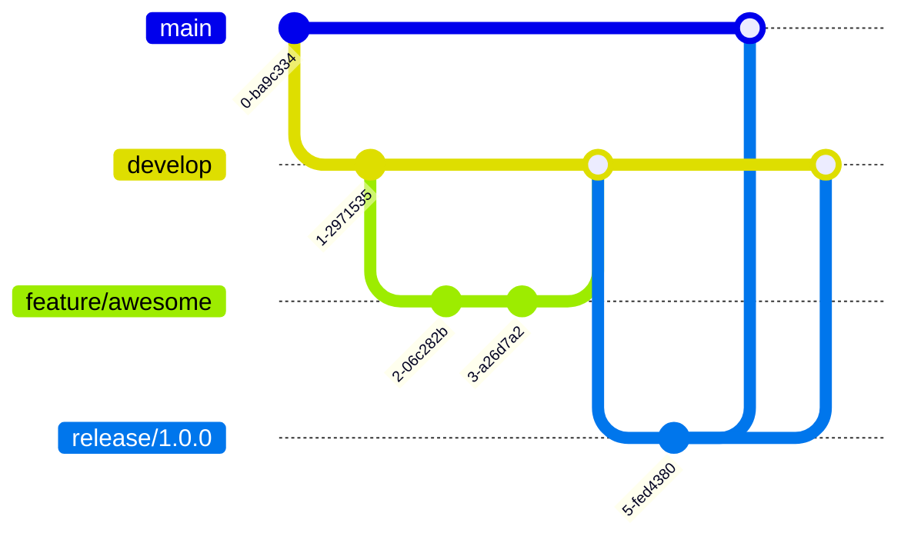

# 🚀 Zopio Git Workflow Guide

Welcome to the Zopio project! This guide will help you understand our Git workflow and contribution process.

## 📋 Table of Contents

- [Overview](#overview)
- [Getting Started](#getting-started)
- [Branch Strategy](#branch-strategy)
- [Development Workflow](#development-workflow)
- [Pull Request Process](#pull-request-process)
- [Commit Guidelines](#commit-guidelines)
- [Code Review Process](#code-review-process)
- [Release Process](#release-process)
- [Troubleshooting](#troubleshooting)

## 🌟 Overview

Zopio follows a **GitFlow-inspired** workflow with some modifications to support our community-driven development approach. We emphasize:

- 🤝 Community collaboration
- 🔒 Code quality and security
- 📝 Clear documentation
- ⚡ Fast iteration cycles

## 🚀 Getting Started

### 1. Fork the Repository

```bash
# Go to https://github.com/zopiolabs/zopio
# Click "Fork" button
# Clone your fork locally
git clone https://github.com/YOUR_USERNAME/zopio.git
cd zopio
```

### 2. Set Up Remotes

```bash
# Add upstream remote
git remote add upstream https://github.com/zopiolabs/zopio.git

# Verify remotes
git remote -v
# origin    https://github.com/YOUR_USERNAME/zopio.git (fetch)
# origin    https://github.com/YOUR_USERNAME/zopio.git (push)
# upstream  https://github.com/zopiolabs/zopio.git (fetch)
# upstream  https://github.com/zopiolabs/zopio.git (push)
```

### 3. Keep Your Fork Updated

```bash
# Fetch upstream changes
git fetch upstream

# Update your main branch
git checkout main
git merge upstream/main
git push origin main

# Update develop branch
git checkout develop
git merge upstream/develop
git push origin develop
```

## 🌿 Branch Strategy

### Main Branches



- **`main`** - Production-ready code
  - Protected branch
  - Requires 2 reviews from Core team
  - Auto-deploys to production
  
- **`develop`** - Integration branch
  - Latest features
  - Requires 1 review
  - Base for feature branches
  
- **`staging`** - Pre-production testing
  - For testing release candidates
  - Requires 1 review

### Feature Branches

- **`feat/*`** - New features
- **`fix/*`** - Bug fixes
- **`docs/*`** - Documentation updates
- **`chore/*`** - Maintenance tasks
- **`test/*`** - Test improvements
- **`refactor/*`** - Code refactoring

### Special Branches

- **`release/*`** - Release preparation
- **`hotfix/*`** - Emergency production fixes

### 🔍 Automated Branch Naming Enforcement

Our repository uses an automated GitHub Actions workflow (`branch-naming.yml`) to ensure all branches follow standardized naming conventions. This helps maintain consistency and improves developer workflow.

#### How It Works

1. **Triggers**: The workflow runs when:
   - A pull request is opened, edited, or synchronized
   - A new branch is created

2. **Validation**: The workflow checks if your branch name matches allowed patterns

3. **For Invalid Branch Names**:
   - ❌ The workflow fails, preventing merge
   - 💬 An automated comment explains the naming conventions
   - 🏷️ An "invalid branch name" label is added to the PR
   
4. **For Valid Branch Names**:
   - ✅ The workflow passes
   - 🚀 Your PR can proceed through the normal review process

#### Allowed Branch Naming Patterns

| Pattern | Purpose | Example |
|---------|---------|---------|
| `main` | Main production branch | `main` |
| `develop` | Development integration branch | `develop` |
| `staging` | Pre-production testing | `staging` |
| `feat/*` or `feature/*` | New features | `feat/user-authentication` |
| `fix/*` | Bug fixes | `fix/payment-calculation` |
| `hotfix/*` | Emergency production fixes | `hotfix/critical-security-patch` |
| `release/v*.*.*` | Release branches (semantic versioning) | `release/v1.2.0` |
| `docs/*` | Documentation updates | `docs/api-guide` |
| `chore/*` | Maintenance tasks | `chore/update-dependencies` |
| `test/*` | Test additions or fixes | `test/add-integration-tests` |
| `refactor/*` | Code refactoring | `refactor/optimize-queries` |
| `ci/*` | CI/CD pipeline changes | `ci/add-security-scan` |
| `build/*` | Build system changes | `build/webpack-optimization` |
| `perf/*` | Performance improvements | `perf/reduce-bundle-size` |
| `style/*` | Code style/formatting changes | `style/prettier-config` |
| `revert/*` | Reverting previous commits | `revert/feature-x` |
| `v*.*` | Version branches | `v1.0` |
| `sync/*` | Synchronization branches | `sync/upstream-changes` |
| `dependabot/*` | Automated dependency updates | `dependabot/npm/next-15.0.0` |

#### Best Practices

- Use **descriptive names** that clearly indicate the purpose
- Keep branch names **lowercase** with hyphens for spaces
- Include **ticket/issue numbers** when relevant: `feat/AUTH-123-oauth-integration`
- Delete branches after merging to keep the repository clean

## 💻 Development Workflow

### 1. Start New Work

```bash
# Update your fork
git fetch upstream
git checkout develop
git merge upstream/develop

# Create feature branch
git checkout -b feat/my-awesome-feature

# Make your changes
# ... edit files ...

# Stage and commit
git add .
git commit -m "feat(module): add awesome feature"
```

### 2. Development Guidelines

- ✅ Write tests for new features
- ✅ Update documentation
- ✅ Follow code style (enforced by Biome)
- ✅ Keep commits small and focused
- ✅ Use conventional commits

### 3. Push Your Work

```bash
# Push to your fork
git push origin feat/my-awesome-feature
```

## 📥 Pull Request Process

### 1. Before Creating a PR

- [ ] Run tests: `pnpm test`
- [ ] Run linter: `pnpm lint`
- [ ] Run type check: `pnpm typecheck`
- [ ] Update documentation if needed
- [ ] Ensure no merge conflicts

### 2. Create Pull Request

1. Go to your fork on GitHub
2. Click "Compare & pull request"
3. Select base branch (usually `develop`)
4. Fill out the PR template completely
5. Link related issues
6. Request reviews if you know specific reviewers

### 3. PR Title Format

Follow conventional commits:

```
type(scope): description

Examples:
feat(auth): add OAuth2 support
fix(crud): resolve data race condition
docs: update installation guide
chore(deps): upgrade to Next.js 15
```

### 4. After Creating PR

- 🤖 Automated checks will run
- 🏷️ Labels will be auto-applied
- 👀 Wait for reviews
- 💬 Respond to feedback promptly
- 🔄 Update PR as needed

## 📝 Commit Guidelines

### Conventional Commits

We use [Conventional Commits](https://www.conventionalcommits.org/):

```
<type>(<scope>): <subject>

<body>

<footer>
```

### Types

- `feat`: New feature
- `fix`: Bug fix
- `docs`: Documentation changes
- `style`: Code style changes (formatting, etc.)
- `refactor`: Code refactoring
- `perf`: Performance improvements
- `test`: Test changes
- `build`: Build system changes
- `ci`: CI configuration changes
- `chore`: Other changes

### Examples

```bash
# Simple commit
git commit -m "feat: add user profile page"

# With scope
git commit -m "fix(auth): resolve login timeout issue"

# Breaking change
git commit -m "feat(api)!: change response format

BREAKING CHANGE: API responses now use camelCase"

# Multi-line commit
git commit -m "refactor(crud): improve query performance

- Add database indexes
- Optimize N+1 queries
- Cache frequently accessed data

Closes #123"
```

## 👀 Code Review Process

### For Authors

1. **Self-review** your PR first
2. **Respond** to all comments
3. **Update** PR based on feedback
4. **Re-request** review after changes
5. **Don't force push** after reviews start

### For Reviewers

1. **Be constructive** and kind
2. **Suggest improvements** with examples
3. **Approve** when satisfied
4. **Request changes** for blocking issues
5. **Use threads** for discussions

### Review Checklist

- [ ] Code follows project style
- [ ] Tests are included and passing
- [ ] Documentation is updated
- [ ] No security vulnerabilities
- [ ] Performance impact considered
- [ ] Breaking changes documented

## 🚢 Release Process

### 1. Release Preparation

```bash
# Create release branch
git checkout -b release/1.2.0 develop

# Update version numbers
# Update CHANGELOG.md
# Fix any last-minute issues

git commit -m "chore: prepare release 1.2.0"
```

### 2. Release Checklist

- [ ] All tests passing
- [ ] Documentation updated
- [ ] CHANGELOG.md updated
- [ ] Version bumped
- [ ] Migration guide (if breaking changes)

### 3. Merge and Tag

```bash
# Merge to main
git checkout main
git merge --no-ff release/1.2.0
git tag -a v1.2.0 -m "Release version 1.2.0"

# Back-merge to develop
git checkout develop
git merge --no-ff release/1.2.0
```

## 🔧 Troubleshooting

### Sync Issues

```bash
# Reset to upstream state
git fetch upstream
git checkout main
git reset --hard upstream/main
```

### Merge Conflicts

```bash
# Update your branch
git fetch upstream
git rebase upstream/develop

# Resolve conflicts
# Edit conflicted files
git add .
git rebase --continue
```

### Accidental Commits

```bash
# Undo last commit (keep changes)
git reset --soft HEAD~1

# Undo last commit (discard changes)
git reset --hard HEAD~1
```

## 📚 Additional Resources

- [Contributing Guidelines](.github/CONTRIBUTING.md)
- [Code of Conduct](.github/CODE_OF_CONDUCT.md)
- [Security Policy](.github/SECURITY.md)
- [Branch Strategy](.github/BRANCHES.md)
- [Conventional Commits](.github/conventional-commits.md)

## 🙋 Getting Help

- 💬 [GitHub Discussions](https://github.com/zopiolabs/zopio/discussions)
- 🐛 [Issue Tracker](https://github.com/zopiolabs/zopio/issues)
- 📧 [Email Support](mailto:support@zopio.dev)

---

**Happy coding!** 🎉 Remember, every contribution makes Zopio better for everyone!